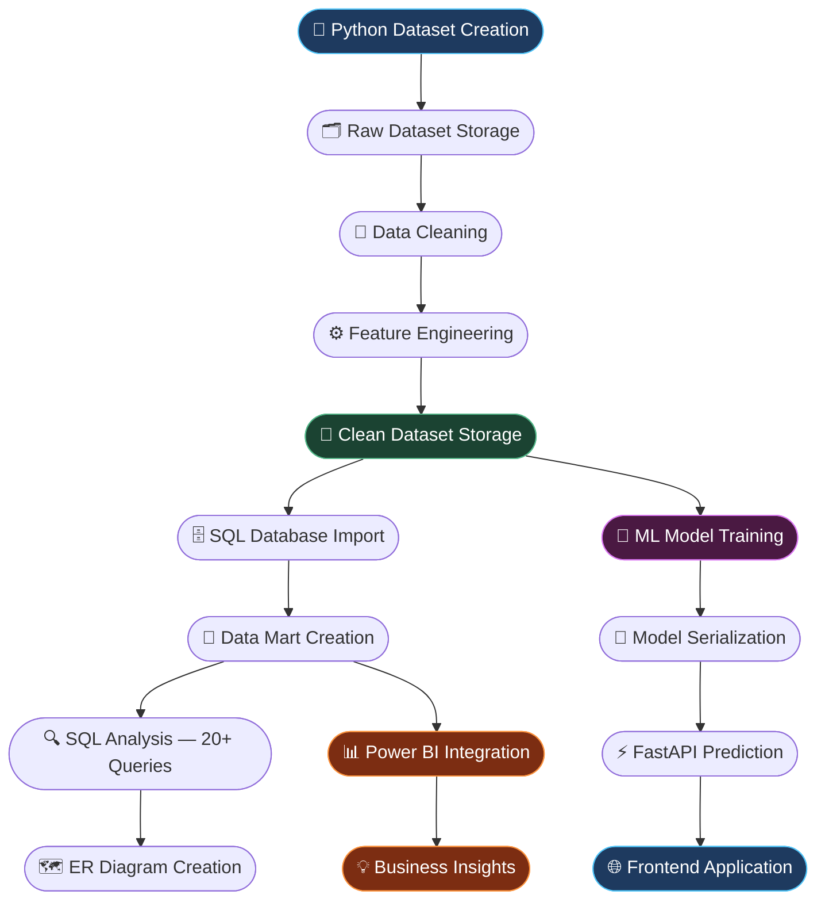

<div align="center">

# 📈 Stock Market Intelligence & Prediction System

### *End-to-End Data Analyst Project using Python, SQL, Power BI, Machine Learning, and FastAPI*

<br>


<br>


</div>

---

## 🌟 Project Overview

This is a **fully end-to-end, production-grade Data Analytics & Machine Learning project** built on the Indian Stock Market (NSE). Unlike typical projects that rely on pre-collected external datasets, this project **generates its own realistic stock market dataset using Python**, then takes it through a complete analytical pipeline — from raw data creation to interactive web-based predictions.

| Stage | Technology | Description |
|-------|-----------|-------------|
| 🏗️ Dataset Creation | Python | Synthetically generated realistic NSE stock market data |
| 🧹 Data Cleaning | Python / Jupyter | 8 specialized cleaning notebooks for each data domain |
| ⚙️ Feature Engineering | Python | Derived financial metrics and predictive features |
| 🗄️ SQL Analysis | SQL Server | Data import, Data Mart creation, 20+ analytical queries |
| 📊 Visualization | Power BI | 8 interactive dashboards with cross-filter intelligence |
| 🤖 ML Model | Scikit-Learn | Trained prediction model serialized as `.pkl` |
| ⚡ API | FastAPI | RESTful prediction endpoint for real-time inference |
| 🌐 Frontend | HTML/CSS/JS | Interactive web interface to display stock predictions |

---

## 🔄 Complete Project Workflow



---

## 🗺️ ER Diagram

The data model is built on **5 core entity tables** connected through a clean relational schema, forming the backbone of both the SQL analysis layer and Power BI dashboards.

<div align="center">


</div>

### 🔗 Entity Relationships

| Entity | Primary Key | Connects To | Relationship |
|--------|------------|-------------|--------------|
| **NSE Prices** (base_price) | `symbol + date` | Company Fundamentals | Many-to-One |
| **Company Fundamentals** | `symbol` | NSE Prices, Volumes | One-to-Many |
| **Daily Sentiment** | `symbol + date` | NSE Prices | Many-to-One |
| **Global Indices** | `date` | NSE Prices | One-to-Many |
| **Volumes** | `symbol + date` | NSE Prices | One-to-One |
| **Macro Data** | `date` | NSE Prices | One-to-Many |

> 📌 **Design Logic:** The `NSE Prices` table acts as the central **fact table**, with company, sentiment, volume, macro, and global data as **dimension tables** — a classic star schema optimized for analytical queries.

---

## 📊 Dashboard Showcase

> **8 Power BI dashboards** built from SQL-connected live data, enabling cross-filtered intelligence across market segments.

---

### 🏠 Market Overview Dashboard

<div align="center">


</div>

---

### 🏢 Company Fundamentals Dashboard

<div align="center">


</div>

---

### 📈 Stock Price Trend Dashboard

<div align="center">


</div>

---

### 📦 Volume Analysis Dashboard

<div align="center">


</div>

---

### 🧠 Market Sentiment Intelligence Dashboard

<div align="center">


</div>

---

### 🌍 Global Market Intelligence Dashboard

<div align="center">


</div>

---

### 🇮🇳 Indian Stock Market Intelligence & Analytics

<div align="center">


</div>

---


## 🚀 Step-by-Step Project Workflow

### Step 1 — 🏗️ Dataset Creation Using Python
**📁 Folder:** `CREATION_OF_DATASET_USING_PYTHON/`

The dataset is **not collected from any external source**. It was entirely **synthesized using Python** to simulate real NSE stock market behavior — including OHLCV prices, company fundamentals, macro indicators, trading volumes, and news sentiment signals.

```
CREATION_OF_DATASET_USING_PYTHON/
└── Stock_Market_Prediction.py       ← Master dataset generation script
```

---

### Step 2 — 🗂️ Raw Dataset Storage
**📁 Folder:** `stock_market_unclean_dataset/`

The generated raw data is organized into **6 domain-specific subdirectories**, mimicking real-world data lake structure.

```
stock_market_unclean_dataset/
├── raw_data/          ← Core OHLCV price data
├── company_data/      ← Fundamentals (P/E, EPS, Market Cap, etc.)
├── macro_data/        ← Inflation, interest rates, GDP data
├── trading_data/      ← Intraday trading volumes
├── news_sentiment/    ← Sentiment scores per stock per day
└── metadata/          ← Ticker symbols, sector mappings
```

---

### Step 3 — 🧹 Data Cleaning Using Python
**📁 Folder:** `Cleaning_Code/`

**8 dedicated Jupyter notebooks** handle cleaning for each data domain separately — ensuring precision without cross-contamination.

```
Cleaning_Code/
├── basa_price_cleaning.ipynb         ← Base price OHLCV cleaning
├── nse_price_cleaning.ipynb          ← NSE-specific price normalization
├── company_data_cleaning.ipynb       ← Fundamentals cleaning & outlier handling
├── macro_data_cleaning.ipynb         ← Macro indicator smoothing
├── meta_data_cleaning.ipynb          ← Symbol & metadata standardization
├── news_sentiment.ipynb              ← Sentiment score normalization
├── global_indices_cleaning.ipynb     ← International index alignment
└── volume_cleaning.ipynb             ← Volume anomaly detection & fixing
```

> Each notebook handles: null treatment, type casting, outlier handling, date normalization, and domain-specific business rules.

---

### Step 4 — ⚙️ Feature Engineering
Performed **within the cleaning notebooks**, adding derived columns like:
- 📐 Moving averages (5-day, 20-day, 50-day)
- 📉 Daily returns & volatility scores
- 📊 RSI, MACD signals
- 💬 Sentiment rolling averages
- 🌏 Global index correlation features
- 🏭 Sector-based normalization

---

### Step 5 — 📁 Clean Dataset Storage
**📁 Folder:** `stock_market_clean_dataset_with_Feature_Eng/`

Post-cleaning, all data consolidates into **7 structured CSV files**, ready for SQL ingestion and ML training.

```
stock_market_clean_dataset_with_Feature_Eng/
├── base_price.csv               ← Clean OHLCV base prices
├── nse_prices.csv               ← NSE-specific cleaned prices
├── company_fundamentals.csv     ← P/E, EPS, Market Cap, Book Value
├── daily_sentiment.csv          ← Daily sentiment scores per symbol
├── global_indices.csv           ← Global market index data
├── inflation_interest.csv       ← Macro economic indicators
└── volumes.csv                  ← Daily trading volumes
```

---

### Step 6 — 🗄️ SQL Analysis
**📁 Folder:** `SQL/`

```
SQL/
├── DATA_IMPORTING_CODE.sql       ← Bulk imports all 7 CSVs into SQL tables
├── SQL Data Mart.sql             ← Creates star schema Data Mart
└── QUESTION_WITH_SOLUTION.sql    ← 20+ business analytical queries
```

**Highlights:**
- ✅ All 7 clean CSVs imported into SQL relational database
- ✅ Data Mart designed with fact + dimension table architecture
- ✅ 20+ real-world analytical queries covering sector performance, volatility ranking, sentiment impact, volume anomalies, macro correlation, and more

---

### Step 7 — 🤖 Machine Learning Model
**📁 Folder:** `ML Model/`

```
ML Model/
├── train_model.py         ← Model training pipeline (Scikit-Learn)
├── predict.py             ← Standalone prediction logic
├── app.py                 ← FastAPI application server
├── stock_model.pkl        ← Trained ML model (serialized)
└── company_encoder.pkl    ← Label encoder for company symbols
```

---

### Step 8 — 🌐 Frontend Application
**📁 Folder:** `frontend/`

```
frontend/
├── index.html     ← Main prediction UI
├── script.js      ← API call logic & result rendering
└── style.css      ← Styling & responsive layout
```

---

### Step 9 — 📊 Power BI Dashboards
**📁 Folder:** `Dashboard/`

```
Dashboard/
├── Market Overview.png
├── Company Fundamentals.png
├── Stock Price Trend.png
├── Volume Analysis Dashboard.png
├── Market Sentiment Intelligence Dashboard.png
├── Global Market Intelligence Dashboard.png
└── Indian Stock Market Intelligence & Analytics.png
```

**Power BI File:** `Stock Market Prediction.pbix`

---

## 🗄️ SQL Analysis Deep Dive

The SQL layer is the analytical engine of this project, enabling structured business intelligence over the cleaned dataset.

### 📥 Data Import Strategy
All 7 cleaned CSV files are loaded into SQL Server using `DATA_IMPORTING_CODE.sql`, creating properly typed relational tables with primary and foreign key constraints.

### 🏗️ Data Mart Architecture
`SQL Data Mart.sql` builds a **star schema** with:
- **Fact Table:** `fact_stock_prices` — daily price + volume records
- **Dimension Tables:** `dim_company`, `dim_date`, `dim_sentiment`, `dim_macro`, `dim_global`

### 🔍 20+ Analytical SQL Queries — Sample Topics

| # | Query Topic |
|---|-------------|
| 1 | Top 10 stocks by average daily return |
| 2 | Sector-wise performance comparison |
| 3 | Stocks with highest volatility (std dev of returns) |
| 4 | Sentiment vs. price movement correlation |
| 5 | Volume anomaly detection (>2x average) |
| 6 | 52-week high/low breaches |
| 7 | Macro interest rate vs. market index movement |
| 8 | Most consistent performers (low drawdown) |
| 9 | Global index impact on NSE movement |
| 10 | Month-over-month growth ranking |
| 11–20+ | Moving average crossovers, EPS vs stock return, sentiment heatmaps, etc. |

---

## 🤖 Machine Learning Model

### 🎯 Model Objective
Predict the **next-day closing price** (or directional movement) of NSE-listed stocks based on historical patterns, macro signals, and sentiment features.

### 🧬 Feature Set Used
- Historical OHLCV data (lagged features)
- Rolling moving averages (5/20/50-day)
- RSI & MACD technical indicators
- Daily sentiment scores (rolling 3-day)
- Macro: inflation rate, interest rate
- Global index returns (S&P 500, DAX, Nikkei proxies)

### 🛠️ Pipeline
```
Clean CSV Data
     ↓
Feature Matrix Construction (train_model.py)
     ↓
Train/Test Split (80/20)
     ↓
Scikit-Learn Model Training
     ↓
Evaluation (MAE, RMSE, R²)
     ↓
Serialization → stock_model.pkl + company_encoder.pkl
     ↓
FastAPI Integration (app.py)
     ↓
Frontend API Calls (script.js)
```

### ⚡ FastAPI Prediction Endpoint
```python
POST /predict
{
  "symbol": "RELIANCE",
  "open": 2450.0,
  "high": 2490.0,
  "low": 2430.0,
  "volume": 1200000,
  "sentiment": 0.65,
  "rsi": 58.2
}

→ Response: { "predicted_close": 2478.5, "confidence": 0.87 }
```

---

## 📊 Power BI Integration

### 🔌 SQL → Power BI Connection
- Power BI Desktop connected directly to **SQL Server** using native connector
- **DirectQuery / Import mode** for live or cached data
- Relationships established mirroring the SQL Data Mart star schema

### 📋 Dashboards Built

| Dashboard | Key Metrics |
|-----------|-------------|
| 🏠 Market Overview | Index movement, daily gainers/losers, market breadth |
| 🏢 Company Fundamentals | P/E ratio, EPS, Market Cap, Book Value trends |
| 📈 Stock Price Trend | OHLCV candlesticks, moving averages, YTD performance |
| 📦 Volume Analysis | Volume spikes, liquidity heatmap, delivery % |
| 🧠 Market Sentiment | Sentiment scores, news impact, bullish/bearish gauge |
| 🌍 Global Market Intelligence | S&P 500 / DAX / Nikkei correlation with NSE |
| 🇮🇳 Indian Market Analytics | Sector rotation, index composition, FII/DII flows |

> **Business Value:** The dashboards enable data-driven decisions by revealing hidden patterns in market sentiment, macro-economic impact, and sector rotation behavior.

---

## 🗂️ Repository Structure

```
Stock-Market-Prediction/
│
├── 📂 CREATION_OF_DATASET_USING_PYTHON/
│   └── Stock_Market_Prediction.py        ← Dataset generation script
│
├── 📂 stock_market_unclean_dataset/
│   ├── raw_data/                         ← Core OHLCV raw data
│   ├── company_data/                     ← Company fundamentals
│   ├── macro_data/                       ← Macro economic data
│   ├── trading_data/                     ← Trading volume data
│   ├── news_sentiment/                   ← News sentiment data
│   └── metadata/                         ← Ticker metadata
│
├── 📂 Cleaning_Code/
│   ├── basa_price_cleaning.ipynb
│   ├── company_data_cleaning.ipynb
│   ├── global_indices_cleaning.ipynb
│   ├── macro_data_cleaning.ipynb
│   ├── meta_data_cleaning.ipynb
│   ├── news_sentiment.ipynb
│   ├── nse_price_cleaning.ipynb
│   └── volume_cleaning.ipynb
│
├── 📂 stock_market_clean_dataset_with_Feature_Eng/
│   ├── base_price.csv
│   ├── company_fundamentals.csv
│   ├── daily_sentiment.csv
│   ├── global_indices.csv
│   ├── inflation_interest.csv
│   ├── nse_prices.csv
│   └── volumes.csv
│
├── 📂 SQL/
│   ├── DATA_IMPORTING_CODE.sql           ← CSV import scripts
│   ├── SQL Data Mart.sql                 ← Star schema creation
│   └── QUESTION_WITH_SOLUTION.sql        ← 20+ analytical queries
│
├── 📂 ML Model/
│   ├── train_model.py                    ← ML training pipeline
│   ├── predict.py                        ← Prediction logic
│   ├── app.py                            ← FastAPI server
│   ├── stock_model.pkl                   ← Serialized ML model
│   └── company_encoder.pkl               ← Label encoder
│
├── 📂 frontend/
│   ├── index.html                        ← Web interface
│   ├── script.js                         ← API integration
│   └── style.css                         ← Styling
│
├── 📂 Dashboard/
│   ├── Market Overview.png
│   ├── Company Fundamentals.png
│   ├── Stock Price Trend.png
│   ├── Volume Analysis Dashboard.png
│   ├── Market Sentiment Intelligence Dashboard.png
│   ├── Global Market Intelligence Dashboard.png
│   └── Indian Stock Market Intelligence & Analytics.png
│
├── 🗺️ E-R Diagram.png                   ← Entity-Relationship Diagram
├── 📊 Stock Market Prediction.pbix       ← Power BI report file
└── 📄 README.md
```

---

## 🛠️ Tech Stack

| Category | Technology | Purpose |
|----------|-----------|---------|
| **Language** |  | Dataset creation, cleaning, ML |
| **Data Manipulation** |   | Data transformation & feature engineering |
| **Machine Learning** |  | Model training & prediction |
| **API Framework** |  | Prediction REST API |
| **Database** |  | Data storage & analytical queries |
| **BI & Visualization** |  | Interactive dashboards |
| **Notebooks** |  | Data cleaning & EDA |
| **Frontend** |    | Web prediction interface |
| **Model Serialization** | Pickle (`.pkl`) | Save & load trained models |

---

## 👤 Author

<div align="center">


### Harsh Soni
**Data Analyst**

*Passionate about transforming raw data into actionable intelligence through end-to-end analytical pipelines.*

[](https://www.linkedin.com/in/harsh-soni-data-analyst)
[](https://github.com/)

</div>

---

<div align="center">


**⭐ If you found this project helpful, please consider giving it a star!**

*Built with ❤️ by Harsh Soni — Data never lies, but it needs the right analyst to speak.*

</div>
